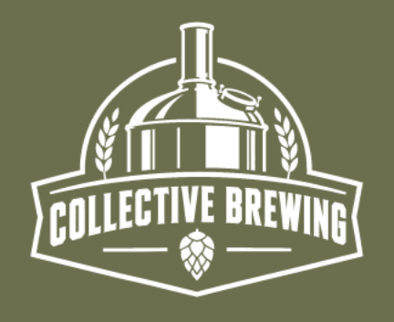
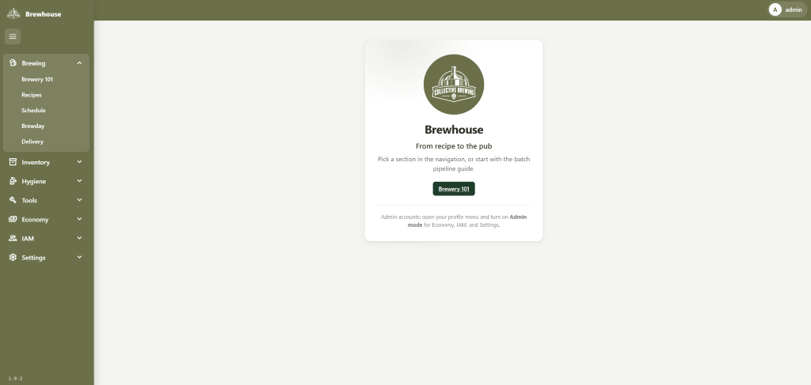
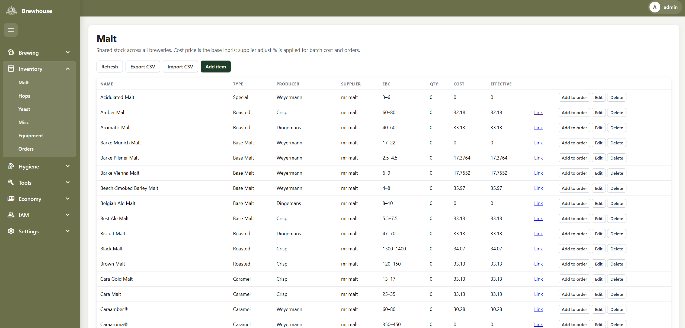
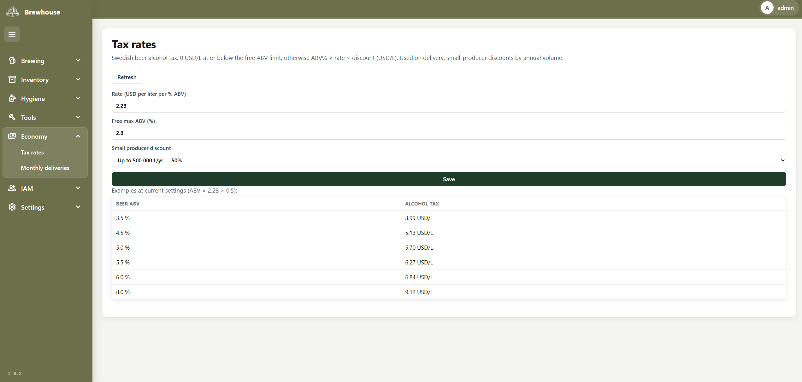
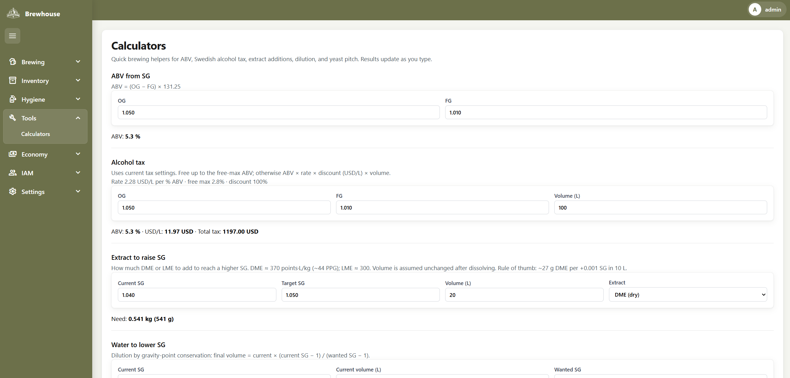
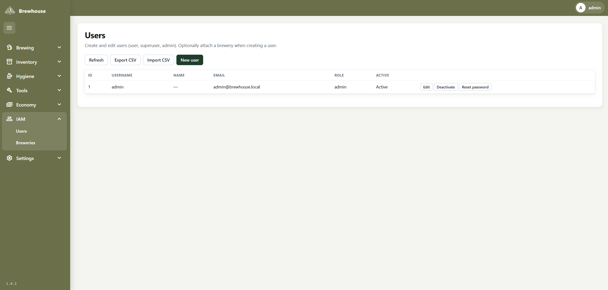
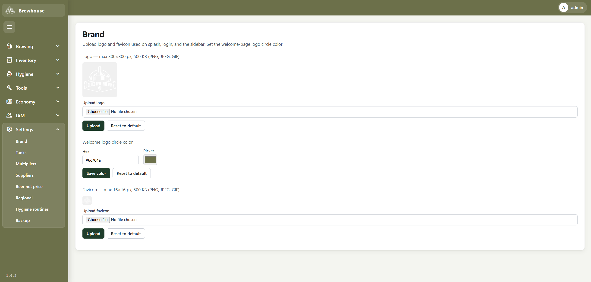

# Brewhouse - Collective Brewing: A Brewery Management System

Collective brewing is a brewery managment system for breweries that share inventory and brewery equipment.




## Features

- Shared inventory across breweries (malt, hops, yeast, misc, equipment) with a base **cost price** per item
- **Suppliers** (admin → Settings): each supplier has an `adjust_percent`; **effective cost** = `cost_price × (1 + adjust_percent / 100)`. Shown in inventory and applied when recipes or orders snapshot cost (historical snapshots are not rewritten when the % changes)
- First-run seed catalogs under [`app/src/internal/database/seed/`](app/src/internal/database/seed/) use English product names and link items to the default supplier **mr malt**. Seeding only fills **empty** categories—existing DBs with a catalog already loaded are not re-seeded

## Screenshots

### Login


### Main shell



### Inventory



### Economy



### Calculators



### IAM



### Settings



## Tech

This app runs on HTMX + Go WASM GUI, Go HTTP API, SQLite

## Prerequisites

- Go 1.26+

## Run locally

From `app/src`:

```powershell
# Optional: local config (copy once, then edit)
Copy-Item .env.example .env

# Build WASM + server with version from VERSION baked into the binary.
# Also cross-compiles Windows/Linux amd64 and writes release zips under dist/:
#   dist/brewhouse-<version>-windows-amd64.zip
#   dist/brewhouse-<version>-linux-amd64.zip
.\scripts\build.ps1

# Or for a quick server-only run (reads VERSION file at startup; rebuild WASM separately if needed)
$env:GOOS = "js"; $env:GOARCH = "wasm"
go build -o internal/web/static/wasm/app.wasm ./cmd/wasm
Remove-Item Env:GOOS; Remove-Item Env:GOARCH
Copy-Item "$(go env GOROOT)/lib/wasm/wasm_exec.js" internal/web/static/js/wasm_exec.js
go run ./cmd
```

Open http://localhost:8080 — splash loads, then the login page. On first start the default **admin** account is created and its generated password is shown on the login page until the first successful sign-in (save it securely).

### App version

Bump [`VERSION`](app/src/VERSION) when releasing. Production builds (`.\scripts\build.ps1`) inject it into the binary with `-ldflags` and package Windows + Linux amd64 zip archives under `app/src/dist/`. The splash UI, shell, and `/api/version` (WASM stale-reload) all use that value. Azure does not need an app-settings version — the deployed binary already carries it.

Optional override: set `APP_VERSION` in the environment if you must force a version without rebuilding (takes effect only when the binary still has the placeholder `dev`).

### Environment

Configuration is read from process environment variables. For local development, copy `.env.example` to `.env` in `app/src` (or the repo root); the app loads `.env` only to fill keys that are not already set. On Azure Web App (or any host), set the same names as **Application settings** — no `.env` file is required, and host env vars always win.

| Variable        | Default                              | Description                          |
|-----------------|--------------------------------------|--------------------------------------|
| `PORT`          | `8080`                               | HTTP listen port                     |
| `DATABASE_PATH` | `brewhouse.db`                       | SQLite database file path            |
| `BACKUP_DIR`    | `backups`                            | Directory for SQLite backup files    |
| `JWT_SECRET`    | `brewhouse-dev-secret-change-me`     | HMAC secret for JWTs (dev default)   |
| `APP_VERSION`   | (from `VERSION` / ldflags)           | Optional override when binary is `dev` |

Set a strong `JWT_SECRET` in any real deployment (including Azure). Passwords are stored as bcrypt hashes, never plaintext.

### Install as app (PWA)

Brewhouse is installable from Chrome/Edge when served over **HTTPS** or **localhost**: use the browser’s Install / “Add to Home Screen” option after the service worker registers. Icons and the web app manifest live under `/static/`. Bumping `VERSION` and rebuilding updates the service worker cache name so clients pick up a new shell.

## Deploy on STRATO Linux VPS

Brewhouse ships as a single Linux amd64 binary (SQLite, no extra runtime). A small [STRATO Linux VPS](https://www.strato.se/server/vps-linux/) is enough—**VPS S** (1 vCore, 2 GB RAM, Ubuntu 24.04 LTS) works for a typical brewery install. You get root access, firewall controls, and a free SSL certificate for one domain via STRATO.

### 1. Create the server

1. Order a Linux VPS and pick **Ubuntu 24.04 LTS** (or Debian 12).
2. In the STRATO customer panel, open the firewall and allow **SSH (22)** and **HTTP/HTTPS (80/443)**. Keep app port `8080` closed from the internet if you put a reverse proxy in front.
3. Note the server IPv4 address and set your domain’s **A record** to that IP (domain can be ordered/managed at STRATO).

### 2. Install the release

Build locally with `.\scripts\build.ps1`, then copy the Linux zip to the VPS (or download it from your release storage):

```bash
# On the VPS (as root or with sudo)
sudo useradd --system --home /opt/brewhouse --shell /usr/sbin/nologin brewhouse
sudo mkdir -p /opt/brewhouse
# scp dist/brewhouse-<version>-linux-amd64.zip from your PC, then:
sudo unzip brewhouse-*-linux-amd64.zip -d /opt/brewhouse
sudo chown -R brewhouse:brewhouse /opt/brewhouse
cd /opt/brewhouse
sudo -u brewhouse cp .env.example .env
sudo -u brewhouse nano .env   # set a strong JWT_SECRET; leave PORT=8080 behind the proxy
sudo chmod +x brewhouse
```

### 3. systemd service

```bash
sudo tee /etc/systemd/system/brewhouse.service >/dev/null <<'EOF'
[Unit]
Description=Brewhouse brewery management
After=network.target

[Service]
Type=simple
User=brewhouse
Group=brewhouse
WorkingDirectory=/opt/brewhouse
EnvironmentFile=/opt/brewhouse/.env
ExecStart=/opt/brewhouse/brewhouse
Restart=on-failure
RestartSec=5

[Install]
WantedBy=multi-user.target
EOF

sudo systemctl daemon-reload
sudo systemctl enable --now brewhouse
sudo systemctl status brewhouse
```

### 4. HTTPS reverse proxy (Caddy)

STRATO includes a free single-domain SSL certificate; the simplest path on Ubuntu is **Caddy** (automatic HTTPS) or nginx with the STRATO cert. Example with Caddy:

```bash
sudo apt update && sudo apt install -y caddy
sudo tee /etc/caddy/Caddyfile >/dev/null <<'EOF'
your.domain.example {
	reverse_proxy 127.0.0.1:8080
}
EOF
sudo systemctl enable --now caddy
sudo systemctl reload caddy
```

Open `https://your.domain.example`. On first start, save the generated **admin** password from the login page before the first successful sign-in.

### Upgrades

1. Stop the service: `sudo systemctl stop brewhouse`
2. Replace `/opt/brewhouse/brewhouse` with the new binary (keep `.env`, `brewhouse.db`, and `backups/`)
3. Start again: `sudo systemctl start brewhouse`

Database file and nightly backups live under `DATABASE_PATH` / `BACKUP_DIR` from `.env`—back those up before major changes (STRATO VPS backups are not included by default).
